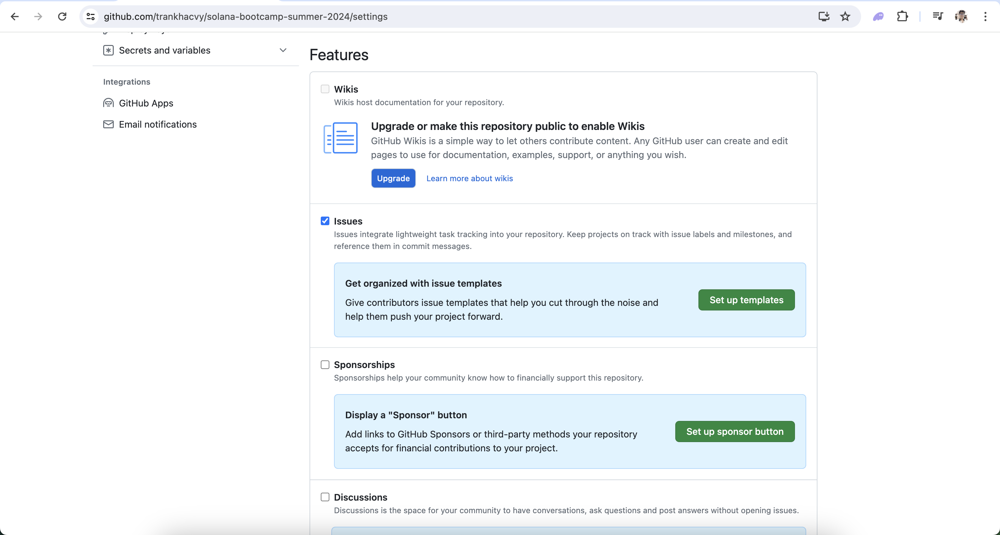

# FPT University Solana Bootcamp

Welcome to the FPT University Solana Bootcamp repository! This repository is a collection of code to guide you through the a month Solana development training sessions.

## Get Started

1. **Fork the Repository:** If you're a part of this class, kindly [fork](https://docs.github.com/en/get-started/quickstart/fork-a-repo#forking-a-repository) this repository.
2. **Set Your Fork to Public:** This helps us in evaluating and collaborating on your assignments.
3. **Syncing and Updates:** After every session, we will push relevant assignments here. Ensure you [sync your forked repository](https://docs.github.com/en/pull-requests/collaborating-with-pull-requests/working-with-forks/syncing-a-fork) to pull the exercise templates.

## Assignments Schedule

| Lesson | Topic                                                                     | Deadline   |
| --- | ------------------------------------------------------------------------- | ---------- |
| 2   | [Introduction to cryptography and Solana clients](./lesson-2/challenge/)                                 | 01/06/2024 |
| 3   | [Using Common Solana Programs](./lesson-3/challenge/)                                 | 01/06/2024 |
| 4   | [Solana program development](./lesson-4/challenge/)                                 | 01/06/2024 |

Stay tuned for updates on future assignments!

## Assignment Submission

To submit your assignments, please ensure you have enabled the **Issues** feature in your forked repository. If it's disabled by default, you can enable it by navigating to `Settings > General` on your fork. Scroll down to the `Features` sub-section and check the `Issues` box.

.

Once enabled, follow these steps for each submission:

1. **Code Submission**: Place your submitted code in the respective `/lesson-[number]/challenge` folder on your fork.
2. **Deployment**: Deploy your program on Devnet when necessary.
3. **Issue Creation**: Open an issue in your forked repository with the title `Submission for challenge [number]`. Ensure you include the public preview link in the issue description. Refer to [this example issue](https://github.com/trankhacvy/fptu-solana-bootcamp/issues/1) for guidance.

## Evaluation Criteria

We evaluate assignments based on the following criteria:

- **Timeliness**: The assignment must be submitted by the deadline (based on the time of the last commit in the assignment folder).
- **Requirements Fulfillment**: The assignment must fulfill all mandatory requirements.

Our team will carefully assess your submissions. After evaluation, we'll share the results and offer feedback on the corresponding open issue.

## Support

Should you have any questions or run into any issues, don't hesitate to reach out on [our Discord](https://discord.gg/gZmWJ5jQ). We are happy to help!

Best of luck with your training! 🌟